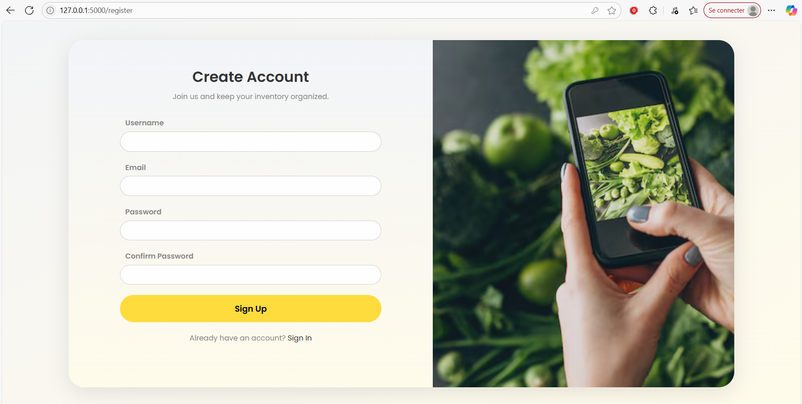
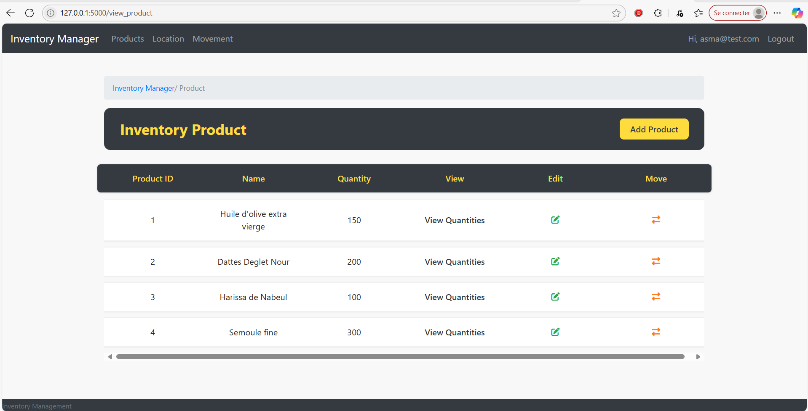
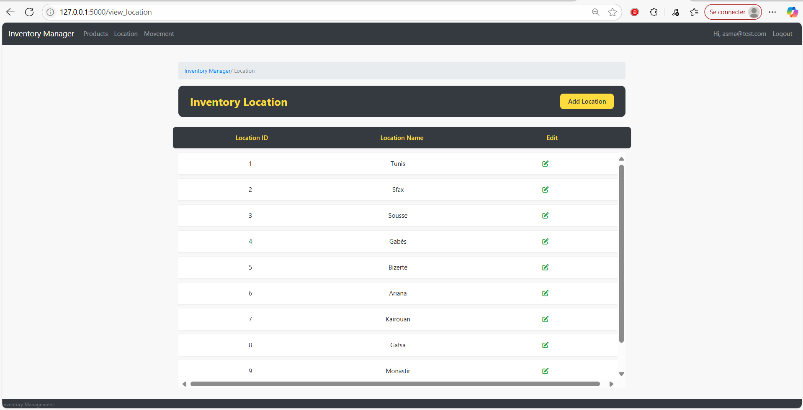
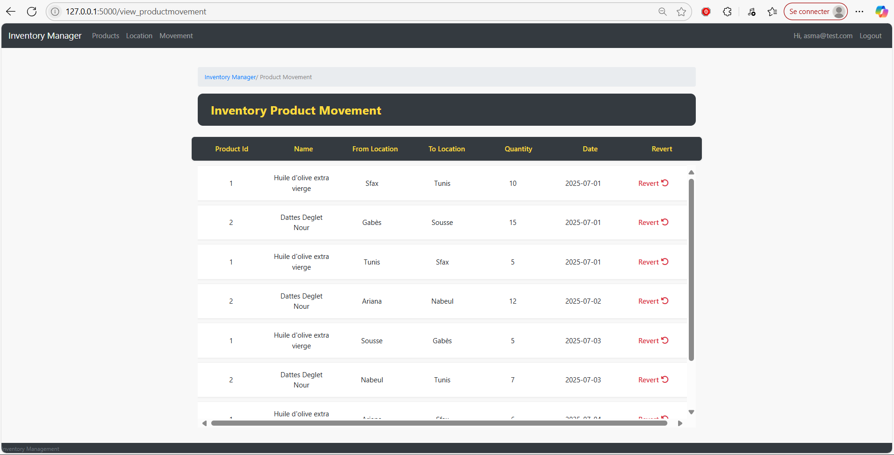
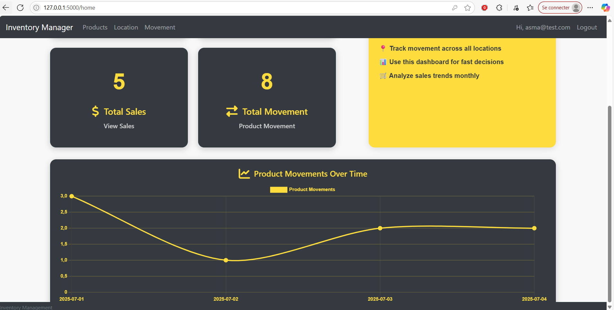

# Inventory Management System

A simple inventory management web application built with **Flask**, **MySQL**, and **Bootstrap**. This project allows authenticated users to manage product stocks across various Tunisian cities, track inventory movements, and visualize product flows over time.

---

## 📦 Features

- 🧾 User Authentication (Login/Logout)
- 📍 Manage multiple locations (e.g., Tunis, Sfax, Sousse)
- 📦 Track products and their quantities
- 🔄 Record product movements between locations
- 📊 View a graph of product movements over time (interactive)
- 🧑 Role-based product views (per user)

---

## 🗺 Locations Supported

- Tunis
- Sfax
- Sousse
- Gabès
- Bizerte
- Ariana
- Kairouan
- Gafsa
- Monastir
- Nabeul

---

## 🛠 Technologies Used

- **Backend:** Flask (Python)
- **Frontend:** Jinja2 + Bootstrap + Chart.js
- **Database:** MySQL (InnoDB)
- **Authentication:** Flask-Login
- **Styling:** Bootstrap 4 / SB-Admin2 template

---

## 🚀 Getting Started

### ✅ Prerequisites

- Python 3.10+
- MySQL Server
- pip
## 🖼️ Dashboard
The dashboard provides a quick overview of inventory statistics, product quantities, and recent movements.

## 🔐 Page de connexion

## 🧑‍💻 Enregistrement (Register)

Users can create an account using the registration page.

---

## 📋 Liste des produits

Displays all products with their current quantities and associated actions.

---

## ➕ Ajouter un produit

Add a new product with its initial quantity.

---

## ✏️ Modifier un produit

Edit the name or quantity of an existing product.

---

## 🔄 Mouvement de produit

Transfer product quantities between locations.

---

## 📍 Ajouter un emplacement (location)

Add new warehouse or city locations.

---

## 📌 Liste des emplacements

View all available locations with option to edit.

---

## 🛠️ Modifier un emplacement

Update a location’s name.

---

## 🚚 Liste des mouvements

History of all product transfers between locations.

---

## 📊 Courbe de mouvements

A line chart showing product movement trends over time.

---
