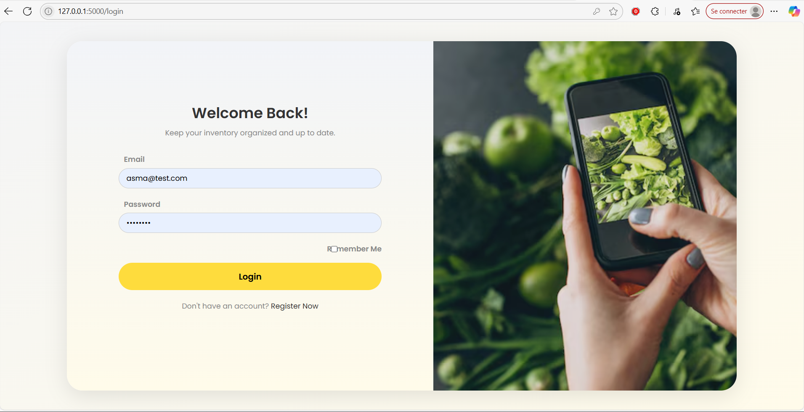

# 🇹🇳 Inventory Management System - Tunisia Version

A simple inventory management web application built with **Flask**, **MySQL**, and **Bootstrap**. This project allows authenticated users to manage product stocks across various Tunisian cities, track inventory movements, and visualize product flows over time.

---

## 📦 Features

- 🧾 User Authentication (Login/Logout)
- 📍 Manage multiple locations (e.g., Tunis, Sfax, Sousse)
- 📦 Track products and their quantities
- 🔄 Record product movements between locations
- 📊 View a graph of product movements over time (interactive)
- 🧑 Role-based product views (per user)

---

## 🗺 Locations Supported

- Tunis
- Sfax
- Sousse
- Gabès
- Bizerte
- Ariana
- Kairouan
- Gafsa
- Monastir
- Nabeul

---

## 🛠 Technologies Used

- **Backend:** Flask (Python)
- **Frontend:** Jinja2 + Bootstrap + Chart.js
- **Database:** MySQL (InnoDB)
- **Authentication:** Flask-Login
- **Styling:** Bootstrap 4 / SB-Admin2 template

---

## 🚀 Getting Started

### ✅ Prerequisites

- Python 3.10+
- MySQL Server
- pip
## 🖼️ Aperçu du tableau de bord

## 🔐 Page de connexion

## 🧑‍💻 Enregistrement (Register)

L'utilisateur peut créer un compte via la page d'enregistrement.

---

## 📋 Liste des produits

Affiche tous les produits disponibles avec leurs quantités.

---

## ➕ Ajouter un produit

Formulaire permettant l'ajout d'un nouveau produit (nom, quantité initiale, utilisateur).

---

## ✏️ Modifier un produit

Permet de mettre à jour le nom ou la quantité d’un produit.

---

## 🔄 Mouvement de produit

Les utilisateurs peuvent déplacer un produit d’un emplacement à un autre avec quantité, date et origine/destination.

---

## 📍 Ajouter un emplacement (location)

Ajoute un nouveau site géographique (ex. Sfax, Tunis, etc.) dans la base.

---

## 📌 Liste des emplacements

Liste tous les emplacements disponibles dans la base.

---

## 🛠️ Modifier un emplacement

Permet de modifier le nom d’un emplacement.

---

## 🚚 Liste des mouvements

Affiche tous les transferts de produits d’un emplacement à un autre.

---

## 📊 Courbe de mouvements

Représente graphiquement les mouvements de stock sur une période.

---
